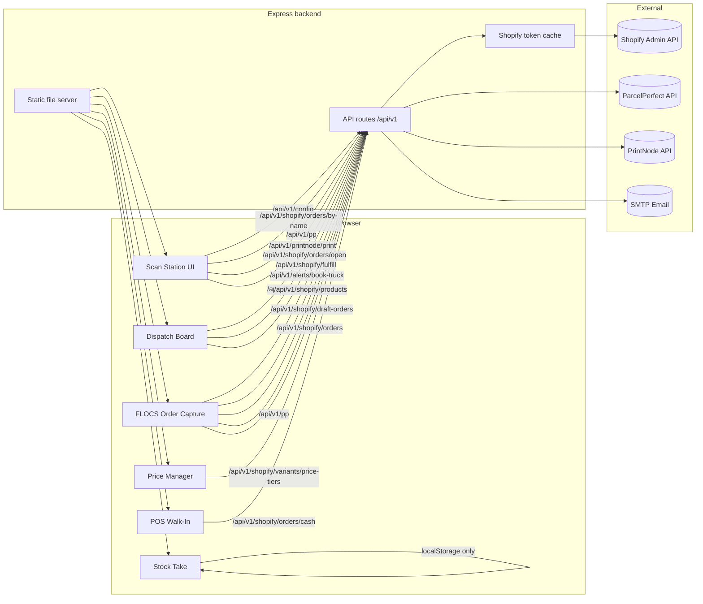

# Flippen Lekka Scan Station (FLSS)

## Scope and purpose

FLSS is a single-page operations console plus supporting services for Flippen Lekka’s warehouse and order-capture workflows. It includes:

- **Scan Station** for booking ParcelPerfect shipments based on scanned parcel barcodes and Shopify order data.
- **Dispatch Board** for triaging open Shopify orders into delivery/shipping/pickup lanes and triggering bookings from a queue.
- **FLOCS (Order Capture)** for creating customers, searching products, quoting shipping, and creating draft orders or orders.
- **Price Manager** for editing SKU price tiers and syncing them to Shopify variant metafields (and optionally public prices).
- **Stock Take** for local/offline stock adjustments stored in browser storage.
- **POS Walk-In** (standalone) for creating cash orders in Shopify from scanned SKUs.

The backend is a Node/Express proxy that hides credentials and normalizes data for ParcelPerfect, Shopify Admin (OAuth client credentials), PrintNode, and email alerts. The frontend never calls those external APIs directly—it always uses the server’s `/api/v1` routes.

---

## High-level architecture



---

## Backend responsibilities (Express)

### Core infrastructure

- **Config + env**: centralized in `src/config.js` and loaded at boot.
- **Middleware**: CORS allowlist, rate limiting (120 requests/min), Helmet, JSON parsing, and logging.
- **Versioned API**: all routes are mounted under `/api/v1`.
- **Static hosting**: serves `/public` and falls back to `index.html` for SPA routes.

### Shopify API proxy (OAuth client credentials)

- Uses `client_credentials` (Dev Dashboard app) to fetch an admin token.
- Tokens are cached in memory with expiry buffer and re-fetched automatically on 401/403.

### ParcelPerfect proxy

- `/api/v1/pp` accepts `method`, `class` (or `classVal`), and `params` for ParcelPerfect requests.
- `/api/v1/pp/place` does place lookups by name or postcode (requires PP token).

### PrintNode proxy

- `/api/v1/printnode/print` accepts base64 PDF content and submits print jobs.
- `/api/v1/printnode/print-url` fetches a PDF from a URL (invoice) and prints it.

### Status + alerts

- `/api/v1/healthz` and `/api/v1/statusz` for service health.
- `/api/v1/alerts/book-truck` sends a truck-collection email via SMTP when parcel count thresholds are exceeded.

---

## Frontend modules

### Scan Station + Dispatch Board (SPA in `public/index.html` + `public/app.js`)

The main operations console embeds multiple views with client-side routing (`/scan`, `/dispatch`, `/flocs`, `/stock`, `/price-manager`). It uses `/api/v1/config` to load runtime UI settings and API base URLs.

Key behavior:

- Parses scanned barcodes into `{ orderNo, parcelSeq }` (last 3 digits = parcel sequence).
- Fetches Shopify order data (`/api/v1/shopify/orders/by-name/:name`).
- Determines expected parcel count from tags (`parcel_count_#`) or manual/scan count.
- Auto-books when tagged or after an idle timer using ParcelPerfect and optionally PrintNode.
- Pulls open orders, lanes them by tags/shipping title, and allows “Book Now” directly from dispatch.
- Tracks booked orders locally to prevent duplicates per device.

### FLOCS (Order Capture)

Embedded as a view in the SPA and also exists in `public/flocs.html` for standalone use.

- Search/select customers, create new customers, and store delivery method/instructions as metafields.
- Search products by title/SKU, load collection items, or use the local SKU catalog.
- Quote shipping with ParcelPerfect and embed shipping details into draft orders or orders.

### Price Manager

A view that edits price tiers stored in `custom.price_tiers` variant metafields. Supports optional syncing of public variant prices.

### Stock Take

Local-only stock counts stored in `localStorage` (no backend dependency).

### POS Walk-In (standalone)

`/pos.html` is a standalone cash-order UI. It scans SKUs, builds a cart, and posts to `/api/v1/shopify/orders/cash` to create a paid Shopify order tagged `pos_cash`.

---

## Data model

### UI configuration (from `/api/v1/config`)

```ts
UIConfig {
  COST_ALERT_THRESHOLD: number
  BOOKING_IDLE_MS: number
  TRUCK_ALERT_THRESHOLD: number
  BOX_DIM: { dim1: number, dim2: number, dim3: number, massKg: number }
  ORIGIN: {
    origpers: string
    origperadd1: string
    origperadd2: string
    origperadd3: string
    origperadd4: string
    origperpcode: string
    origtown: string
    origplace: number
    origpercontact: string
    origperphone: string
    origpercell: string
    notifyorigpers: number
    origperemail: string
    notes: string
  }
  PP_ENDPOINT: string
  SHOPIFY: { PROXY_BASE: string }
  FLOW_TRIGGER_TAG: string
  FEATURE_FLAGS: { MULTI_SHIP: boolean }
}
```

### Core frontend entities

| Entity | Description | Source |
| --- | --- | --- |
| `orderDetails` | Normalized Shopify order used for booking (name, address, line items, weights, parcel counts, place code). | `/api/v1/shopify/orders/by-name/:name` + `/api/v1/pp/place` |
| `parcel` | Parsed scan info `{ orderNo, parcelSeq }`. | Scan input parsing |
| `dispatchOrder` | Order card info for dispatch board lanes. | `/api/v1/shopify/orders/open` |
| `shipment` | Recently fulfilled shipment with tracking info. | `/api/v1/shopify/shipments/recent` |
| `fulfillmentEvent` | Tracking events for a fulfillment. | `/api/v1/shopify/fulfillment-events` |
| `priceTiers` | Variant price tier map `{ default, agent, retailer, export, private, fkb }`. | `/api/v1/shopify/variants/price-tiers*` |
| `posLineItem` | POS cart item with SKU, variantId, price, quantity. | POS Walk-In UI |
| `stockLevels` | Local SKU → count map. | `localStorage` |

### Shopify entities (normalized by backend)

| Entity | Key fields | Notes |
| --- | --- | --- |
| `Customer` | `id`, `name`, `email`, `phone`, `addresses`, `default_address`, `tags`, `delivery_method`, `deliveryInstructions`, `companyName`, `vatNumber` | Delivery metadata lives in `custom.*` metafields. |
| `Order` | `id`, `name`, `shipping_address`, `line_items`, `tags`, `fulfillment_status` | Used for booking and dispatch lanes. |
| `DraftOrder` | `id`, `name`, `invoice_url`, `tags`, `shipping_line` | Created by FLOCS. |
| `Fulfillment` | `tracking_number`, `tracking_url`, `tracking_company`, `shipment_status` | Derived in `/shipments/recent`. |

### ParcelPerfect entities

| Entity | Fields | Notes |
| --- | --- | --- |
| `Booking request` | `{ method, class, params }` | Form-encoded and proxied to ParcelPerfect. |
| `Place lookup` | `getPlacesByName` / `getPlacesByPostcode` | Used when no place code is stored on a customer/order. |

### PrintNode entities

| Entity | Fields | Notes |
| --- | --- | --- |
| `Print job` | `printerId`, `title`, `contentType`, `content` | Prints ParcelPerfect labels or invoice PDFs. |

---

## API reference (server)

> All endpoints are prefixed with `/api/v1`.

### Config + status

- `GET /api/v1/config` — UI configuration payload used by the SPA.
- `GET /api/v1/healthz` — Basic liveness check.
- `GET /api/v1/statusz` — Aggregated status for PP/Shopify/PrintNode/Email.

### Alerts

- `POST /api/v1/alerts/book-truck` — Send truck collection email (requires SMTP).

### ParcelPerfect

- `POST /api/v1/pp` — Proxy for bookings/quotes. Body: `{ method, class|classVal, params }`.
- `GET /api/v1/pp/place?q=...` — Place lookup by name or postcode.

### PrintNode

- `POST /api/v1/printnode/print` — Print base64 PDF labels.
- `POST /api/v1/printnode/print-url` — Fetch a PDF by URL and print it.

### Shopify

- `GET /api/v1/shopify/customers/search?q=...` — Search customers.
- `POST /api/v1/shopify/customers` — Create customer + metafields.
- `GET /api/v1/shopify/products/search?q=...` — Product/variant search.
- `GET /api/v1/shopify/products/collection?handle=...` — Collection products.
- `POST /api/v1/shopify/variants/price-tiers` — Update variant price tier metafields (and optional public price).
- `POST /api/v1/shopify/variants/price-tiers/fetch` — Fetch tier metadata for variants.
- `POST /api/v1/shopify/draft-orders` — Create draft order.
- `POST /api/v1/shopify/draft-orders/complete` — Complete draft order.
- `POST /api/v1/shopify/orders` — Create order.
- `POST /api/v1/shopify/orders/cash` — Create paid cash order for POS.
- `GET /api/v1/shopify/orders/by-name/:name` — Find order by name.
- `GET /api/v1/shopify/orders/open` — Open orders for dispatch board.
- `GET /api/v1/shopify/orders/list?from=...&to=...` — Order list for reports.
- `POST /api/v1/shopify/orders/run-flow` — Apply a flow tag to an order.
- `GET /api/v1/shopify/shipments/recent` — Recent shipments (non-delivered).
- `GET /api/v1/shopify/fulfillment-events?orderId=...&fulfillmentId=...` — Tracking events.
- `POST /api/v1/shopify/fulfill` — Fulfill an order with tracking.
- `POST /api/v1/shopify/ready-for-pickup` — Mark fulfillment order ready for pickup.
- `POST /api/v1/shopify/notify-collection` — Email customer that order is ready.

---

## Configuration

Configuration is loaded from environment variables (example values shown):

```bash
PORT=3000
HOST=0.0.0.0
NODE_ENV=development
# Optional: comma-separated origins, or "*" to allow all origins
# FRONTEND_ORIGIN=http://localhost:3000,http://192.168.1.25:3000

# ParcelPerfect
PP_BASE_URL=https://adpdemo.pperfect.com/ecomService/v10/Json/
PP_REQUIRE_TOKEN=true
PP_TOKEN=your-parcelperfect-token
PP_ACCNUM=account-number
PP_PLACE_ID=origin-place-id

# Shopify Dev Dashboard OAuth
SHOPIFY_STORE=your-store-subdomain
SHOPIFY_CLIENT_ID=your-client-id
SHOPIFY_CLIENT_SECRET=your-client-secret
SHOPIFY_API_VERSION=2025-10
SHOPIFY_FLOW_TAG=dispatch_flow

# PrintNode
PRINTNODE_API_KEY=your-printnode-api-key
PRINTNODE_PRINTER_ID=123456

# Email (truck alerts + customer notifications)
SMTP_HOST=smtp.example.com
SMTP_PORT=587
SMTP_USER=your-smtp-user
SMTP_PASS=your-smtp-pass
SMTP_SECURE=false
SMTP_FROM=ops@flippenlekkaspices.co.za
TRUCK_EMAIL_TO=dispatch@example.com

# Optional tracking company label used for fulfillments
TRACKING_COMPANY=SWE / ParcelPerfect

# UI defaults (override /api/v1/config)
UI_COST_ALERT_THRESHOLD=250
UI_BOOKING_IDLE_MS=6000
UI_TRUCK_ALERT_THRESHOLD=25
UI_BOX_DIM_1=40
UI_BOX_DIM_2=40
UI_BOX_DIM_3=30
UI_BOX_MASS_KG=5
UI_ORIGIN_PERSON=Flippen Lekka Holdings (Pty) Ltd
UI_ORIGIN_ADDR1=7 Papawer Street
UI_ORIGIN_ADDR2=Blomtuin, Bellville
UI_ORIGIN_ADDR3=Cape Town, Western Cape
UI_ORIGIN_ADDR4=ZA
UI_ORIGIN_POSTCODE=7530
UI_ORIGIN_TOWN=Cape Town
UI_ORIGIN_PLACE_ID=4663
UI_ORIGIN_CONTACT=Louis
UI_ORIGIN_PHONE=0730451885
UI_ORIGIN_CELL=0730451885
UI_ORIGIN_NOTIFY=1
UI_ORIGIN_EMAIL=admin@flippenlekkaspices.co.za
UI_ORIGIN_NOTES=Louis 0730451885 / Michael 0783556277
UI_FEATURE_MULTI_SHIP=true
```

---

## User flows

### Scan Station booking flow

1. Scan barcode → parse `orderNo` + `parcelSeq`.
2. Fetch Shopify order + place code (or ParcelPerfect lookup).
3. If `parcel_count_#` tag exists, booking happens immediately; otherwise an idle timer triggers booking.
4. Submit booking to ParcelPerfect → receive label PDF.
5. Create Shopify fulfillment with tracking, optionally print label via PrintNode.

### Dispatch Board flow

1. Fetch open orders every 30s and group into lanes.
2. “Book Now” runs the same booking flow as Scan Station.
3. “Print delivery note” renders a printable note for delivery orders.
4. If parcel count exceeds thresholds, a truck alert email can be sent.

### FLOCS flow

1. Search or create a customer (delivery method stored as metafield).
2. Pick delivery mode, addresses, and products.
3. Quote shipping if needed.
4. Create a draft order or order; optionally complete drafts.

### POS Walk-In flow

1. Scan a SKU or product code to build a cart.
2. Adjust quantities; review total + receipt.
3. Create a paid cash order in Shopify tagged `pos_cash`.

---

## Running locally

```bash
npm install
npm run dev
```

Open:

- `http://localhost:3000` for Scan Station, Dispatch Board, FLOCS, Stock, Price Manager.
- `http://localhost:3000/pos.html` for POS Walk-In.

---

## Developer guide

### Backend structure

- **`src/app.js`** — Express app setup (middleware, routes, static hosting).
- **`src/config.js`** — Environment configuration and defaults.
- **`src/routes/`** — Routers for Shopify, ParcelPerfect, PrintNode, config, alerts, and status.
- **`src/services/`** — Shopify token cache, SMTP, ParcelPerfect helpers.
- **`src/utils/`** — Shared HTTP helpers.
- **`server.js`** — Entrypoint that starts the Express app.

### Frontend structure

- **`public/index.html` + `public/app.js`** — SPA shell + Scan/Dispatch/FLOCS/Stock/Price Manager views.
- **`public/views/`** — View-specific CSS/JS (FLOCS, Stock, Price Manager, POS).
- **`public/flocs.html`** — Standalone FLOCS page (legacy alternative to SPA view).
- **`public/pos.html`** — Standalone POS Walk-In page.

### Adding a new backend endpoint

1. Create or extend a route file in `src/routes/`.
2. Add integration logic in `src/services/` if needed.
3. Register the router in `src/app.js`.
4. Document it in the API reference section of this README.

---

## Operational notes

- Barcode format expects the last three digits to be the parcel sequence number (e.g., `ORDERNO###`).
- Booked orders are blocked locally in browser storage to reduce duplicate bookings.
- Price tiers are stored in Shopify variant metafield `custom.price_tiers` and can be used by the Shopify theme for customer-specific pricing.

---

## File map

- `server.js` — Entrypoint.
- `src/app.js` — Express middleware + route registration + static hosting.
- `src/config.js` — Environment configuration defaults.
- `src/routes/` — Routers for ParcelPerfect/Shopify/PrintNode/config/status/alerts.
- `src/services/` — Shopify token cache, SMTP transport, ParcelPerfect helpers.
- `src/utils/http.js` — Shared HTTP helpers.
- `public/index.html` + `public/app.js` — SPA + Scan Station + Dispatch Board + embedded views.
- `public/views/flocs.*` — FLOCS view assets.
- `public/views/stock.*` — Stock view assets.
- `public/views/price-manager.*` — Price Manager assets.
- `public/views/pos.*` — POS view assets.
- `public/flocs.html` — Standalone FLOCS page.
- `public/pos.html` — Standalone POS page.
- `.env.example` — Example environment config.
- `package.json` — Scripts and dependencies.
