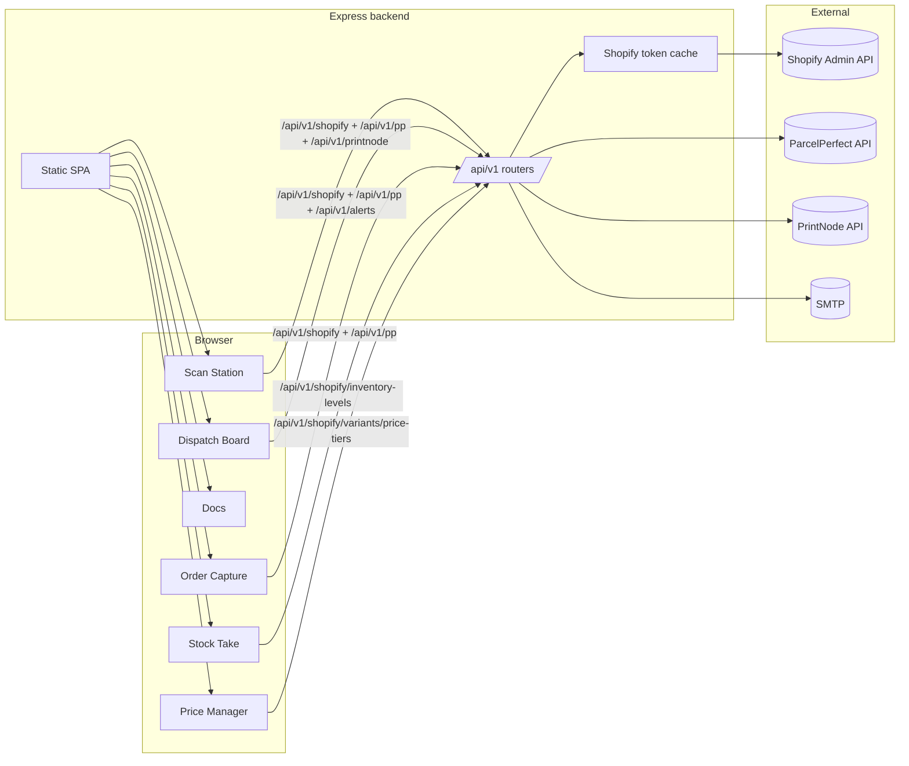

# Flippen Lekka Scan Station (FLSS)

## Overview

FLSS is a single-page operations console for Flippen Lekka that runs on a Node/Express backend. The frontend is a SPA served from `public/` and the backend proxies requests to Shopify, ParcelPerfect, and PrintNode. All backend endpoints are mounted under `/api/v1`.

**Primary modules (SPA routes)**

- **Scan Station** (`/`) — scan parcel barcodes, auto-book shipments, print labels, and fulfill Shopify orders.
- **Dispatch Board** (`/ops`) — triage open orders, trigger bookings, and print delivery notes.
- **Documentation** (`/docs`) — embedded operator guide and API reference.
- **FLOCS / Order Capture** (`/flocs`) — create customers, search products, quote shipping, and create draft orders/orders.
- **Stock Take** (`/stock`) — load Shopify inventory levels, apply stock take/receive adjustments, and keep an activity log in `localStorage`.
- **Price Manager** (`/price-manager`) — review price tiers, sync tiers to Shopify metafields, and optionally update storefront pricing.

`/stock.html` and `/price-manager.html` are static entrypoints that redirect into the SPA routes for those modules.

---

## Architecture



---

## Backend responsibilities

### Express app (`src/`)

- **App setup**: CORS, rate limiting, Helmet, JSON parsing, and request logging live in `src/app.js`.
- **Routing**: API routers are mounted at `/api/v1` for status, config, ParcelPerfect, Shopify, PrintNode, and alert email endpoints.
- **Static hosting**: the SPA is served from `public/`, with a catch-all route that returns `index.html`.

### Shopify proxy

The server uses Shopify OAuth client credentials (Admin API) with token caching and retry logic. Shopify endpoints cover:

- Customer search/creation
- Product search, collection loading, and price tier metafields
- Draft orders + completion
- Orders (create, cash orders, list/open/by-name, parcel count update)
- Fulfillment (fulfillments, ready-for-pickup, fulfillment events)
- Flow trigger endpoint
- Inventory lookups and adjustments
- Email notifications for courier collection

### ParcelPerfect proxy

- `/api/v1/pp` sends booking/quote requests as form-encoded payloads.
- `/api/v1/pp/place` performs place lookups by name or postcode.

### PrintNode proxy

- `/api/v1/printnode/print` submits base64-encoded PDF labels to PrintNode.

### Email alerts

- `/api/v1/alerts/book-truck` sends “book a truck” emails via SMTP when parcel thresholds are hit.
- `/api/v1/shopify/notify-collection` emails customers when a courier collection is ready.

---

## Frontend highlights

### Scan Station

- Parses barcode scans into `{ orderNo, parcelSeq }`.
- Fetches order details from Shopify and optionally resolves ParcelPerfect place codes.
- Auto-books on `parcel_count` metafields or after a configurable idle timer.
- Prints labels and fulfills orders via Shopify once booking succeeds.

### Dispatch Board

- Polls open orders and recent shipments to keep the board current.
- Allows “Book Now” workflows and delivery note printing.
- Tracks daily parcel counts and triggers truck booking email alerts.

### FLOCS / Order Capture

- Search and create customers (including delivery method metafields).
- Search products or load collections, then build draft orders/orders.
- Request ParcelPerfect quotes to populate shipping lines.
- Includes `/order-capture-custom.html` for local-password-protected custom normal order entry (PBKDF2 hash stored in localStorage).

### Stock Take

- Loads Shopify inventory levels per variant and location.
- Supports stock take (set) and stock received (adjust) modes.
- Persists activity logs in `localStorage` for audit visibility.

### Price Manager

- Reads and writes `custom.price_tiers` variant metafields.
- Optionally syncs pricing tiers into the Shopify variant `price` field.

---

## API reference (server)

All endpoints are available under `http://localhost:3000/api/v1` by default.

### Status & config

- `GET /healthz` — basic health check.
- `GET /statusz` — full integration status (Shopify, ParcelPerfect, PrintNode, SMTP).
- `GET /config` — UI configuration (box dims, booking timeout, origin details, feature flags).

### ParcelPerfect

- `POST /pp` — booking/quote proxy.
- `GET /pp/place?q=...` — place lookup.

### PrintNode

- `POST /printnode/print` — submit base64 PDF labels.

### Shopify (selected endpoints)

- Customers: `GET /shopify/customers/search`, `POST /shopify/customers`
- Products: `GET /shopify/products/search`, `GET /shopify/products/collection`
- Price tiers: `POST /shopify/variants/price-tiers`, `POST /shopify/variants/price-tiers/fetch`
- Draft orders: `POST /shopify/draft-orders`, `POST /shopify/draft-orders/complete`
- Orders: `POST /shopify/orders`, `POST /shopify/orders/cash`, `GET /shopify/orders/by-name/:name`, `GET /shopify/orders/open`, `GET /shopify/orders/list`
- Parcel counts: `POST /shopify/orders/parcel-count`
- Flow triggers: `POST /shopify/orders/run-flow`
- Fulfillment: `POST /shopify/fulfill`, `POST /shopify/ready-for-pickup`, `GET /shopify/fulfillment-events`, `GET /shopify/shipments/recent`
- Inventory: `GET /shopify/inventory-levels`, `POST /shopify/inventory-levels/set`, `POST /shopify/inventory-levels/transfer`, `GET /shopify/locations`
- Email notifications: `POST /shopify/notify-collection`

### Alerts

- `POST /alerts/book-truck` — send truck booking email when parcel thresholds are reached.

---

## Configuration

Configuration is read from environment variables. Key settings include:

```bash
PORT=3000
HOST=0.0.0.0
FRONTEND_ORIGIN=http://localhost:3000

# ParcelPerfect
PP_BASE_URL=https://adpdemo.pperfect.com/ecomService/v10/Json/
PP_REQUIRE_TOKEN=true
PP_TOKEN=your-parcelperfect-token
PP_ACCNUM=account-number
PP_PLACE_ID=origin-place-id

# Shopify Dev Dashboard OAuth
SHOPIFY_STORE=your-store-subdomain
SHOPIFY_CLIENT_ID=your-client-id
SHOPIFY_CLIENT_SECRET=your-client-secret
SHOPIFY_API_VERSION=2025-10
SHOPIFY_FLOW_TAG=dispatch_flow

# PrintNode
PRINTNODE_API_KEY=your-printnode-api-key
PRINTNODE_PRINTER_ID=123456

# SMTP (alerts + customer notifications)
SMTP_HOST=smtp.example.com
SMTP_PORT=587
SMTP_USER=...
SMTP_PASS=...
SMTP_SECURE=false
SMTP_FROM=ops@example.com
TRUCK_EMAIL_TO=dispatch@example.com

# UI tuning
UI_BOOKING_IDLE_MS=6000
UI_COST_ALERT_THRESHOLD=250
UI_TRUCK_ALERT_THRESHOLD=25
UI_FEATURE_MULTI_SHIP=true
```

---

## Running locally

```bash
npm install
npm run dev
```

Open `http://localhost:3000` for the Scan Station/Dispatch/Docs SPA, `http://localhost:3000/flocs` for order capture, `http://localhost:3000/order-capture-custom.html` for password-protected custom normal order capture, `http://localhost:3000/stock` for stock take, and `http://localhost:3000/price-manager` for price tier management.

---

## Project layout

- `server.js` — entrypoint that boots the Express app.
- `src/app.js` — middleware orchestration + static hosting bootstrap (uses route manifest).
- `src/config.js` — environment configuration.
- `src/routes/index.js` — centralized API router manifest (single place to add/remove backend route modules).
- `src/routes/` — ParcelPerfect, Shopify, PrintNode, alerts, config, status route modules.
- `src/services/` — Shopify token handling + SMTP helpers.
- `public/` — SPA UI (HTML/CSS/JS), route entrypoints, and assets.
```
