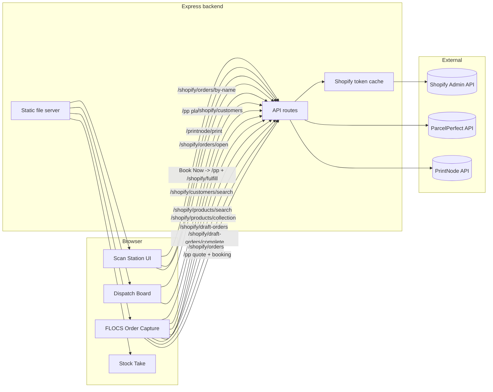

# Flippen Lekka Scan Station (FLSS)

## Scope and purpose

FLSS is a single-page operations console for Flippen Lekka that combines three operator workflows behind one Node/Express backend:

- **Scan Station** for booking ParcelPerfect shipments based on scanned parcel barcodes and Shopify order data.
- **Dispatch Board** for triaging open Shopify orders into delivery/shipping/pickup lanes.
- **FLOCS (Order Capture)** for creating Shopify customers, searching products, quoting shipping, and creating draft orders/orders.
- **Stock Take** for offline/local stock adjustments stored in browser storage.

The server acts as a secure proxy to ParcelPerfect, Shopify Admin APIs (OAuth client credentials), and PrintNode. It also serves the static frontend pages from `/public`.【F:server.js†L1-L453】【F:public/index.html†L1-L530】【F:public/app.js†L1-L1716】【F:public/flocs.html†L1-L200】【F:public/flocs.js†L1-L200】【F:public/stock.js†L1-L200】

---

## High-level architecture



The browser pages call the server through same-origin endpoints, which then proxy to external services (with rate limiting, CORS, and token caching). The frontend never talks directly to Shopify/ParcelPerfect/PrintNode—only to the server. The server also handles static files, SPA fallback, and a health check.【F:server.js†L1-L453】【F:public/index.html†L1-L530】

---

## Backend responsibilities (Express)

### Core infrastructure

- **Config + env**: server config is read from environment variables (host/port, ParcelPerfect, Shopify, PrintNode, CORS origins).【F:server.js†L18-L60】
- **Middleware**: CORS allowlist, rate limiting (120 requests/min), Helmet, JSON parsing, logging, and OPTIONS handling.【F:server.js†L62-L113】
- **Static hosting**: serves `/public` files and routes `/flocs` to the order capture UI, with SPA fallback to `index.html`.【F:server.js†L434-L446】

### Shopify API proxy (client credentials)

- Shopify uses **OAuth client_credentials** flow via the Dev Dashboard app. The server requests a token and caches it (with expiry buffer). Calls are retried if the token is invalidated.【F:server.js†L120-L207】

### ParcelPerfect proxy

- `/pp` accepts a method/class/params payload, then submits a form-encoded request to ParcelPerfect and returns JSON or text.【F:server.js†L209-L271】
- `/pp/place` does place lookups by name or postcode (requires PP token).【F:server.js†L388-L433】

### PrintNode proxy

- `/printnode/print` accepts base64 PDF content and sends a print job to PrintNode for label printing.【F:server.js†L435-L503】

### Shopify domain endpoints

- Customers: search and create customers with optional delivery method metafield.【F:server.js†L273-L374】
- Products: search by title/SKU and load collection items.【F:server.js†L376-L564】
- Draft orders: create and complete draft orders (with tags, shipping lines, and note attributes).【F:server.js†L566-L699】
- Orders: create orders, find by name, list open orders, and fulfill orders with tracking data.【F:server.js†L701-L873】

---

## Frontend modules

### 1) Scan Station (index + app.js)

Primary operator workflow for scanning parcel barcodes and booking shipments.

**Key responsibilities**

- Parse scanned barcodes into `{orderNo, parcelSeq}` (last 3 digits are parcel sequence).【F:public/app.js†L1160-L1197】
- Fetch Shopify order details via `/shopify/orders/by-name/:name`.【F:public/app.js†L1224-L1318】
- Determine expected parcel count from Shopify tags (`parcel_count_#`) or manual/scan count. If tagged, booking triggers on the first scan; otherwise a 6s idle timer triggers booking automatically in auto mode.【F:public/app.js†L300-L470】【F:public/app.js†L1199-L1286】
- Generate waybill previews and optionally print via PrintNode / ParcelPerfect responses (PDF base64).【F:public/app.js†L1460-L1716】
- Fulfill the order in Shopify after booking, and store booked orders in `localStorage` to prevent duplicate bookings in the session/device.【F:public/app.js†L430-L556】【F:public/app.js†L1578-L1716】

### 2) Dispatch Board (index + app.js)

Ops dashboard that lists open Shopify orders in lanes (delivery/shipping/pickup), with a “Book Now” action or delivery note printing.

- Pulls open orders from `/shopify/orders/open` every 30 seconds and filters by age/status.【F:public/app.js†L1341-L1460】【F:public/app.js†L1605-L1716】
- Assigns orders to lanes based on tags and shipping line titles (`warehouse/collect` → pickup, `local delivery/same day` → delivery, else shipping).【F:public/app.js†L1375-L1418】
- “Book Now” prompts for parcel count, loads the order, and triggers booking flow using Scan Station logic.【F:public/app.js†L1648-L1702】
- “Print delivery note” opens a printable HTML document with line items and shipping address details.【F:public/app.js†L1462-L1533】

### 3) FLOCS (Order Capture)

A standalone page (`/flocs`) to capture a new order:

- Search/select Shopify customers, create new customers, and store a preferred delivery method as a metafield (`custom.delivery_method`).【F:public/flocs.js†L1-L260】【F:server.js†L273-L374】
- Search products by title/SKU, load collection items, or use a local SKU/variant catalog (`CONFIG.PRODUCTS`).【F:public/flocs.js†L1-L200】【F:server.js†L376-L564】
- Calculate shipping quotes via ParcelPerfect (`/pp`) and embed shipping cost/services into draft orders or orders.【F:public/flocs.js†L1-L200】
- Create draft orders, complete them to orders, or create orders directly via Shopify endpoints.【F:public/flocs.js†L1-L200】【F:server.js†L566-L799】

### 4) Stock Take

- Local-only stock counts stored in `localStorage` under `fl_stock_levels_v1` with “stock take” and “stock received” modes; no backend calls required.【F:public/stock.js†L1-L200】

### 5) Price Manager

- Dedicated price-tier editor (`/price-manager.html`) to review SKU pricing tiers and sync tiers into Shopify variant metafields (`custom.price_tiers`).
- Supports optional public price sync to update storefront pricing by writing the variant price through the Admin API.【F:public/price-manager.js†L1-L201】【F:server.js†L289-L366】
- Theme-only pricing logic (no extra app) can be implemented by reading `custom.price_tiers` in your Shopify theme and resolving prices from customer tags. See `docs/price-tiers-theme.md`.

---

## Data model

### Primary entities (frontend)

| Entity | Description | Source |
| --- | --- | --- |
| `orderDetails` | Normalized Shopify order data used for bookings: name, contact details, address, line items, weights, parcel counts, and place code. | `/shopify/orders/by-name/:name` + ParcelPerfect place lookup.【F:public/app.js†L1224-L1318】 |
| `parcel` | Parsed scan information: `{ orderNo, parcelSeq }`. | Scan input parsing logic.【F:public/app.js†L1160-L1197】 |
| `dispatchOrder` | Open order card data: customer name, shipping address, line items, status. | `/shopify/orders/open` response transformed by backend.【F:server.js†L756-L873】【F:public/app.js†L1341-L1460】 |
| `flocs state` | Current order capture state including customer, address, items, shipping quote, and price tier. | `state` object in FLOCS JS.【F:public/flocs.js†L116-L180】 |
| `stockLevels` | Local map of SKU → count. | `localStorage` in stock tool.【F:public/stock.js†L34-L112】 |

### Shopify entities (backend normalization)

| Entity | Key fields (used in app) | Notes |
| --- | --- | --- |
| `Customer` | `id`, `name`, `email`, `phone`, `addresses`, `default_address`, `tags`, `delivery_method` metafield | Normalized in `normalizeCustomer`.【F:server.js†L82-L128】【F:server.js†L273-L337】 |
| `Order` | `id`, `name`, `shipping_address`, `line_items`, `tags`, `fulfillment_status` | Used for booking and dispatch board output.【F:server.js†L701-L873】 |
| `DraftOrder` | `id`, `name`, `invoice_url`, `tags`, `shipping_line` | Created from FLOCS for invoicing workflow.【F:server.js†L566-L699】 |

### ParcelPerfect entities

| Entity | Fields | Notes |
| --- | --- | --- |
| `Booking request` | `{ method, class, params }` | Sent as form data to `/pp` with optional `token_id`.【F:server.js†L209-L271】 |
| `Place lookup` | `getPlacesByName` / `getPlacesByPostcode` | Used when Shopify has no stored place code. 【F:server.js†L388-L433】【F:public/app.js†L1224-L1318】 |

### PrintNode entities

| Entity | Fields | Notes |
| --- | --- | --- |
| `Print job` | `printerId`, `title`, `contentType`, `content` | Prints ParcelPerfect PDF labels. 【F:server.js†L435-L503】 |

---

## Automatic actions & background behavior

### Backend

- **Token caching**: Shopify access tokens are cached and refreshed before expiry, with a retry on 401/403 responses.【F:server.js†L120-L207】
- **Rate limiting**: 120 requests/minute (standard headers enabled).【F:server.js†L92-L107】
- **CORS enforcement**: if `FRONTEND_ORIGIN` is set, only origins listed there are allowed (unless `*`). When it is unset, all origins are allowed by default.【F:server.js†L62-L91】

### Scan Station (frontend)

- **Auto-booking by tag**: orders tagged `parcel_count_#` auto-book on first scan (no timer).【F:public/app.js†L1184-L1244】
- **Idle auto-book**: if no tag exists, a 6 second idle timer triggers booking based on scanned parcel count in auto mode.【F:public/app.js†L300-L370】
- **Local booking guard**: booked order numbers are stored in `localStorage` and blocked from re-booking in the same browser session/device.【F:public/app.js†L430-L556】【F:public/app.js†L1170-L1208】
- **Mode preference**: auto/manual mode is persisted in `localStorage` (`fl_mode_v1`).【F:public/app.js†L400-L426】

### Dispatch Board

- **Auto refresh** every 30 seconds to keep the board current with Shopify open orders.【F:public/app.js†L1535-L1716】
- **Audio cues + progress bar** for booking steps; visual/log updates are emitted during booking and print steps.【F:public/app.js†L170-L300】【F:public/app.js†L1535-L1702】

### FLOCS (Order Capture)

- **Customer/product search debounce** and local SKU catalog enable faster entry even if Shopify search is slow or limited.【F:public/flocs.js†L1-L200】
- **Price tiers** are derived from Shopify customer tags to automatically apply price lists (agent/retailer/export/private/fkb).【F:public/flocs.js†L146-L200】

### Stock Take

- **Local persistence**: stock levels are stored and restored from `localStorage`, keeping the tool offline-friendly.【F:public/stock.js†L34-L112】

---

## API reference (server)

> All endpoints are served from the same origin as the frontend (default `http://localhost:3000`).

### ParcelPerfect

- `POST /pp` — ParcelPerfect proxy for booking/quote calls. Expects `{ method, class, params }` JSON body. 【F:server.js†L209-L271】
- `GET /pp/place?q=...` — ParcelPerfect place lookup by name or postcode. 【F:server.js†L388-L433】

### Shopify

- `GET /shopify/customers/search?q=...` — Search customers. 【F:server.js†L273-L337】
- `POST /shopify/customers` — Create customer with optional delivery method metafield. 【F:server.js†L339-L374】
- `GET /shopify/products/search?q=...` — Product + variant search. 【F:server.js†L376-L470】
- `GET /shopify/products/collection?handle=...` — Products in a collection. 【F:server.js†L472-L564】
- `POST /shopify/draft-orders` — Create draft order. 【F:server.js†L566-L669】
- `POST /shopify/draft-orders/complete` — Complete draft order. 【F:server.js†L671-L721】
- `POST /shopify/orders` — Create order. 【F:server.js†L723-L799】
- `GET /shopify/orders/by-name/:name` — Find order by Shopify name. 【F:server.js†L801-L873】
- `GET /shopify/orders/open` — Open orders for dispatch board. 【F:server.js†L875-L956】
- `POST /shopify/fulfill` — Fulfill order with tracking. 【F:server.js†L958-L1057】

### PrintNode

- `POST /printnode/print` — Print a base64 PDF to a configured printer. 【F:server.js†L435-L503】

### Customer portal

- `POST /customer/login` — Verify special customer credentials and return a short-lived token. 【F:src/routes/customer.js†L1-L212】
- `POST /customer/orders` — Place an order as a logged-in special customer. Requires `Authorization: Bearer <token>`. 【F:src/routes/customer.js†L214-L321】

### Utility

- `GET /healthz` — Health check. 【F:server.js†L505-L507】

---

## Configuration

Configuration comes from environment variables. The server expects these at runtime (example values shown):

```bash
PORT=3000
HOST=0.0.0.0
# Optional: comma-separated origins, or "*" to allow all origins
# FRONTEND_ORIGIN=http://localhost:3000,http://192.168.1.25:3000

# ParcelPerfect
PP_BASE_URL=https://adpdemo.pperfect.com/ecomService/v10/Json/
PP_REQUIRE_TOKEN=true
PP_TOKEN=your-parcelperfect-token
PP_ACCNUM=account-number
PP_PLACE_ID=origin-place-id

# Shopify Dev Dashboard OAuth
SHOPIFY_STORE=your-store-subdomain
SHOPIFY_CLIENT_ID=your-client-id
SHOPIFY_CLIENT_SECRET=your-client-secret
SHOPIFY_API_VERSION=2025-10

# PrintNode
PRINTNODE_API_KEY=your-printnode-api-key
PRINTNODE_PRINTER_ID=123456

# Customer portal
CUSTOMER_AUTH_SECRET=super-long-random-secret
CUSTOMER_AUTH_TTL_MINUTES=60
# JSON array of special customers with access codes + Shopify customer IDs
# Example:
# SPECIAL_CUSTOMERS=[{"email":"vip@example.com","passcode":"VIP-2024","customerId":123456789}]
```

The included `.env.example` file is a starting point, but Shopify configuration has been updated to use OAuth client credentials in the server (see `SHOPIFY_CLIENT_ID` and `SHOPIFY_CLIENT_SECRET`).【F:server.js†L18-L60】【F:.env.example†L1-L18】

---

## User flows

### Scan Station booking flow

1. Operator scans a parcel barcode → parse `orderNo` + `parcelSeq`.
2. App fetches Shopify order data and customer place code (metafield or ParcelPerfect lookup).
3. If order has `parcel_count_#` tag, booking happens immediately; otherwise scans accumulate and idle timer triggers booking.
4. Booking request goes to ParcelPerfect via `/pp` with service + parcel details; a label PDF may be returned.
5. Booking result triggers Shopify fulfillment with tracking number and optional label printing via PrintNode.

All steps are logged to the UI, and the order number is added to local blocked list to prevent duplicate booking in the same device session.【F:public/app.js†L1160-L1716】【F:server.js†L209-L503】【F:server.js†L958-L1057】

### Dispatch Board flow

1. Frontend fetches open orders every 30s and groups into lanes.
2. Clicking **Book Now** prompts for parcel count, loads the order, and runs the booking flow.
3. Clicking **Print delivery note** opens a printable document for delivery orders.

This allows warehouse/ops to book shipments from a dispatch overview without switching to the scan view.【F:public/app.js†L1341-L1716】

### FLOCS flow

1. Search or create a customer.
2. Pick delivery method (ship/pickup/deliver), select address, and select products.
3. Optionally quote shipping (ParcelPerfect) to fill the shipping line.
4. Create draft orders or orders in Shopify, optionally completing drafts.

FLOCS embeds pricing logic (customer tag-based tiers) and supports collection-based product loading to speed order creation.【F:public/flocs.js†L116-L200】【F:server.js†L566-L799】

### Stock Take flow

1. Choose mode (stock take vs received).
2. Search SKU and set/add quantities; entries persist locally in `localStorage`.

This tool is local-only and does not talk to the backend or Shopify.【F:public/stock.js†L34-L200】

---

## Running locally

```bash
npm install
npm run dev
```

Open `http://localhost:3000` for Scan Station/Dispatch/Docs, `http://localhost:3000/flocs` for order capture, and `http://localhost:3000/stock.html` for stock take. The server listens on `HOST`/`PORT` and logs allowed origins on boot.【F:package.json†L1-L16】【F:server.js†L1-L17】

---

## Developer guide

### Backend structure (refactored)

The backend is now organized into focused modules under `src/`:

- **`src/app.js`** — Express app setup (middleware, routes, static hosting).
- **`src/config.js`** — Environment configuration and defaults.
- **`src/routes/`** — Domain routers for Shopify, ParcelPerfect, PrintNode, alerts, and status.
- **`src/services/`** — External integrations (Shopify token/cache, SMTP).
- **`src/utils/`** — Shared HTTP helpers.

The root `server.js` is a thin entrypoint that imports the app and starts the listener.【F:src/app.js†L1-L65】【F:src/config.js†L1-L36】【F:src/routes/shopify.js†L1-L649】【F:src/routes/parcelperfect.js†L1-L104】【F:src/routes/printnode.js†L1-L62】【F:src/routes/alerts.js†L1-L60】【F:src/routes/status.js†L1-L48】【F:src/services/shopify.js†L1-L115】【F:src/services/email.js†L1-L21】【F:src/utils/http.js†L1-L6】【F:server.js†L1-L17】

### Adding a new backend endpoint

1. Create a new route file in `src/routes/` (or extend an existing router).
2. Add shared integration logic in `src/services/` if needed.
3. Register the router in `src/app.js`.
4. Update the API reference in this README if the endpoint is public-facing.

### Configuration tips

- Keep new env vars grouped in `src/config.js` so defaults are centralized.
- For any email-related feature, reuse `src/services/email.js` so SMTP settings stay consistent.【F:src/config.js†L1-L36】【F:src/services/email.js†L1-L21】

---

## Operational notes

- The frontend assumes barcode format where the last three digits are parcel sequence numbers (`ORDERNO###`).【F:public/app.js†L1160-L1197】
- Orders are blocked locally after booking to reduce accidental duplicates; clear browser storage if you need a manual override on the same device.【F:public/app.js†L430-L556】【F:public/app.js†L1170-L1208】
- The Scan Station has a print-specific stylesheet for 100×150mm labels, and a local HTML fallback if ParcelPerfect PDF printing is unavailable.【F:public/index.html†L200-L330】【F:public/app.js†L1460-L1716】

---

## File map

- `server.js` — Entrypoint that starts the Express app. 【F:server.js†L1-L17】
- `src/app.js` — Express middleware + route registration + static hosting. 【F:src/app.js†L1-L65】
- `src/config.js` — Environment configuration defaults. 【F:src/config.js†L1-L36】
- `src/routes/` — Domain routers for ParcelPerfect/Shopify/PrintNode/status/alerts. 【F:src/routes/parcelperfect.js†L1-L104】【F:src/routes/shopify.js†L1-L649】【F:src/routes/printnode.js†L1-L62】【F:src/routes/status.js†L1-L48】【F:src/routes/alerts.js†L1-L60】
- `src/services/` — Shopify token cache + SMTP transport helpers. 【F:src/services/shopify.js†L1-L115】【F:src/services/email.js†L1-L21】
- `src/utils/http.js` — Shared HTTP helpers (bad request, status). 【F:src/utils/http.js†L1-L6】
- `public/index.html` + `public/app.js` — Scan Station + Dispatch Board + embedded docs. 【F:public/index.html†L1-L530】【F:public/app.js†L1-L1716】
- `public/flocs.html` + `public/flocs.js` — FLOCS order capture tool. 【F:public/flocs.html†L1-L200】【F:public/flocs.js†L1-L200】
- `public/price-manager.html` + `public/price-manager.js` — Price manager for tier pricing and storefront sync. 【F:public/price-manager.html†L1-L200】【F:public/price-manager.js†L1-L201】
- `public/stock.html` + `public/stock.js` — Stock take tool. 【F:public/stock.js†L1-L200】
- `.env.example` — Example environment config. 【F:.env.example†L1-L18】
- `package.json` — Scripts and dependencies. 【F:package.json†L1-L16】
