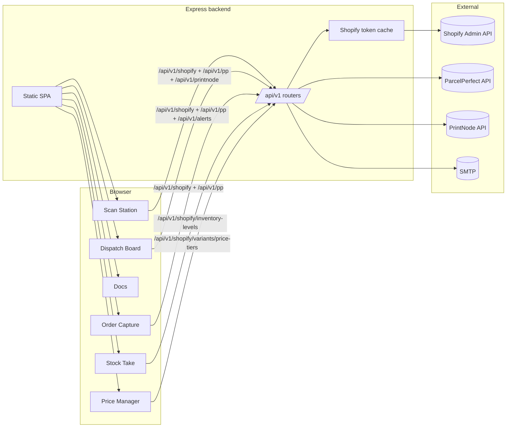

# Flippen Lekka Scan Station (FLSS)

## Overview

FLSS is a single-page operations console for Flippen Lekka that runs on a Node/Express backend. The frontend is a SPA served from `public/` and the backend proxies requests to Shopify, ParcelPerfect, and PrintNode. All backend endpoints are mounted under `/api/v1`.

**Primary modules (SPA routes)**

- **Scan Station** (`/`) — scan parcel barcodes, auto-book shipments, print labels, and fulfill Shopify orders.
- **Dispatch Board** (`/ops`) — triage open orders, trigger bookings, and print delivery notes.
- **Documentation** (`/docs`) — embedded operator guide and API reference.
- **FLOCS / Order Capture** (`/flocs`) — create customers, search products, quote shipping, and create draft orders/orders.
- **Stock Take** (`/stock`) — load Shopify inventory levels, apply stock take/receive adjustments, and keep an activity log in `localStorage`.
- **Price Manager** (`/price-manager`) — review price tiers, sync tiers to Shopify metafields, and optionally update storefront pricing.

`/stock.html` and `/price-manager.html` are static entrypoints that redirect into the SPA routes for those modules.

---


## Quick project guide

- **Build & run guide**: see `docs/build-guide.md`.
- **Core features, add-ons, and data model**: see `docs/data-model.md`.
- **System mind map + process flow chart**: see `docs/system-mind-map-and-process-flow.md`.
- **Professional frontend/backend user manual**: see `docs/full-user-manual-front-and-backend.md`.
- **Automated tests**: run `npm test`.
- **Expose local app on your Cloudflare domain**: see `docs/cloudflare-tunnel.md`.

---

## Comprehensive operator manual (click-by-click)

This section is intended as a full operator runbook. It explains navigation, what each control does, what data it loads, and the normal sequence of clicks for each module/page.

### 0) Start-up and first load checks

1. Run `npm run dev`.
2. Open `http://localhost:3000`.
3. Confirm the top nav renders and the scan input is focused.
4. Open **Documentation** and verify system health (`/api/v1/healthz`) and integration health (`/api/v1/statusz`).
5. If any integration is offline, continue with modules that do not depend on that service (for example docs/templates/local flows) and resolve credentials before booking/printing.

### 1) Global shell controls (visible in the main SPA)

- **Orders** (`navScan`)
  - Click to open the Scan/Operations dashboard route (`/`).
- **Documentation** (`navDocs`)
  - Click to open embedded docs topics loaded from `README.md` + `docs/*.md`.
- **Order capture** (`navFlocs`)
  - Click to open FLOCS customer + product + order builder.
- **Stock take** (`navStock`)
  - Click to open stock tools and purchase-order tools.
- **Price manager** (`navPriceManager`)
  - Click to open price-tier management tools.
- **Scan input** (`scanInput`)
  - Paste/type/scan a parcel barcode and press Enter to load order context.
- **Multi-shipment button** (`multiShipmentBtn`, appears conditionally)
  - Use when combining selected delivery orders into one shipment flow.

### 2) Orders / Scan Station module (`/`)

#### What loads automatically
- UI config from `/api/v1/config` (timeouts, thresholds, feature flags).
- Live status cards (order number, parcel counts, mode, source).
- Server/integration status bar polling.

#### Primary operator sequence
1. Scan barcode in **scanInput**.
2. Verify resolved order number, customer, destination, parcel sequence/list.
3. Confirm place/service override if needed (address search + service selector).
4. Choose booking behavior:
   - leave auto-book on to book after idle timeout, or
   - press **Book Now** (`btnBookNow`) for immediate booking.
5. Review booking progress stages (quote/service/book/print/booked/notify).
6. Print labels (PrintNode path) and confirm fulfillment update in Shopify.

#### Controls you will use often
- **Book Now** (`btnBookNow`): immediate booking for current order/session.
- **Mode toggle** (`modeToggle`): switch workflow modes where enabled.
- **Address search** (`addrSearch`) + results (`addrResults`): look up/override place code.
- **Place code** (`placeCode`): manually force destination place if lookup is ambiguous.
- **Service override** (`serviceOverride`): force courier service code where needed.
- **Emergency stop** (`emergencyStop`): abort/lock accidental in-flight automation action.

### 3) Dispatch Board module (`/ops`)

#### What it is for
A triage board for open orders + recent shipments, with dispatch preparation and booking shortcuts.

#### Core sequence
1. Open dispatch view (from route/module card).
2. Wait for open orders and shipment snapshots to load.
3. Select orders to prepare/dispatch.
4. Click **Prepare deliveries** (`dispatchPrepareDeliveries`) for grouped processing.
5. Open order/shipment detail modals and close with **✕** buttons when done.
6. Clear current selection with **Clear** (`dispatchSelectionClear`) to reset.

#### Dispatch-related controls
- **Prepare deliveries** (`dispatchPrepareDeliveries`): starts prep flow for selected orders.
- **Clear** (`dispatchSelectionClear`): clears selected rows/orders.
- **Truck booking** (`truckBookBtn`): sends truck-booking alert email when threshold reached/approved.
- **Combined shipment** (`dispatchCreateCombined`): create grouped shipment payloads (when enabled).
- **Expand toggle** (`dispatchExpandToggle`): expand/collapse board density/details.

### 4) Documentation module (`/docs`)

- Click a topic in the docs sidebar list (`docsTopics`).
- The markdown body loads in `docsContent`.
- Use docs subnav (`docsSubnav`) for faster jumps when available.
- This is the quickest operator self-help location for route specs and setup instructions.

### 5) FLOCS / Order Capture module (`/flocs`)

#### Intended flow
1. Choose customer path:
   - search existing customer, or
   - click **Add new customer** (`flocs-customerCreateToggle`) then complete form and click **Create customer** (`flocs-customerCreateBtn`).
2. Set customer details (tier, delivery method, VAT/payment terms, addresses).
3. Search/filter products, set quantities, and build cart/invoice preview.
4. Set delivery type and optional PO/reference/date.
5. Click **Calculate shipping** (`flocs-calcShip`) to fetch ParcelPerfect quote.
6. Create transaction:
   - **Create draft order** (`flocs-createDraftBtn`) for review/approval workflow, or
   - **Create order now** (`flocs-createOrderBtn`) for immediate order creation.
7. If needed, use **Convert draft to order** (`flocs-convertBtn`) after draft creation.

#### High-use FLOCS controls
- Customer search/filter/sort: `flocs-customerSearch`, `flocs-customerQuickSearch`, province/sort selects.
- Customer form clear: `flocs-customerResetBtn`.
- Delivery type radio group: `flocs-deliveryGroup`.
- Quantity mode/carton mode controls: `flocs-qtyModeGroup`, `flocs-cartonSizeGroup`.

### 6) Stock Take module (`/stock` in SPA and `stock.html`)

#### Stock tab workflow
1. Choose location (`stock-location`).
2. Filter products via search (`stock-search`).
3. Select mode:
   - **Read only** (no changes),
   - **Stock take** (set counted value),
   - **Stock received** (increment/adjust).
4. For focused adjustment, enter value in `stock-focusInput` and click **Apply** (`stock-focusApply`).
5. Navigate queued rows with **◀ Prev** (`stock-focusPrev`) and **Next ▶** (`stock-focusNext`).
6. Watch activity history/log (`stock-log`) for local audit trail.

#### Purchase-order tab workflow (inside stock module)
1. Switch to Purchase Orders tab (`stock-tabPurchase`).
2. Build PO lines and click **Create draft purchase order** (`po-submit`).
3. In PO list, use row actions:
   - **Receive** to apply receipt adjustments.
   - **Print docs** to print supporting documents (enabled when URL exists).

### 7) Price Manager module (`/price-manager` in SPA and `price-manager.html`)

#### What it does
Loads variants/products, shows tier breakpoints, and allows saving tier metafields and syncing storefront prices when chosen.

#### Typical sequence
1. Wait for product list to load (status shown in `pmStatus`).
2. Filter/search target variants/products.
3. Edit tier columns/values in grid rows.
4. Click row **Save** to write `custom.price_tiers` metafield updates.
5. Use sync action (if enabled in UI context) to push tier-derived price to variant `price`.

### 8) Shipping Matrix page (`/shipping-matrix.html`)

Use for quote simulation only (no booking):
1. Enter weight set(s).
2. Pick destination center type (`all`/`major`/`regional`) or custom places.
3. Run matrix generation to compare costs.
4. Use output table to choose service assumptions for real booking modules.

### 9) Custom Order Capture page (`/order-capture-custom.html`)

#### Authentication + account load
1. Enter local password to unlock page features.
2. (Optional) click **Load account** (`customer-access-load`) to pull account context.

#### Order creation controls
- **Create draft order** (`submit-draft-order`)
- **Create order** (`submit-order`)
- **Print** (`print-form`)
- Quick picker supports search/sort/province filters and close button (`quick-picker-close`).

### 10) Customer Accounts page (`/customer-accounts.html`)

#### Auth area
- **Login** (`loginBtn`) with email/password.
- **Register** (`registerBtn`) with first/last/phone + credentials.

#### Profile area
- Edit profile/address fields, then click **Save profile** (`saveProfileBtn`).
- Click **Logout** (`logoutBtn`) to end session.

#### Ordering area
- Set product quantities, then click **Place order** (`placeOrderBtn`).
- Click **Refresh history** (`refreshOrdersBtn`) to reload order timeline.

### 11) Purchase Orders page (`/purchase-orders.html`)

1. Enter optional supplier (`supplier`).
2. Search materials (`search`).
3. Add required lines/quantities.
4. Click **Create draft purchase order** (`submitBtn`).
5. Confirm returned draft order id/name and tags include `purchase-order`.

### 12) Liquid Templates page (`/liquid-templates.html`)

- **+ New** (`newTemplateBtn`): create a blank template record.
- Template name (`templateName`): set display name.
- Editor: write/update liquid markup.
- **Refresh preview** (`refreshPreviewBtn`): regenerate rendered sample output.
- **Save template** (`saveTemplateBtn`): persist template payload.
- **Delete template** (`deleteTemplateBtn`): remove selected template.

### 13) Notification Templates page (`/notification-templates.html`)

- **+ New** (`newTemplateBtn`): create notification template definition.
- Edit metadata: template name, event key, source, channel, enabled toggle.
- Edit subject/body content.
- **Refresh preview** (`refreshPreviewBtn`) to test rendering.
- **Save template** (`saveTemplateBtn`) to persist.
- **Delete template** (`deleteTemplateBtn`) to remove.

### 14) Operator troubleshooting checklist

1. **Nothing loads / blank state**: check `/api/v1/healthz`, browser console, and env config.
2. **Can’t book shipment**: verify ParcelPerfect credentials + place code validity.
3. **Can’t print**: verify PrintNode key/printer ids and printer online state.
4. **Order/fulfillment issues**: verify Shopify app credentials and scopes.
5. **Email actions fail**: verify SMTP host/auth and sender values.
6. **Stock/price writes blocked**: ensure account permissions and location/variant ids are valid.

---

## API function map (all routers)

All API routes are mounted beneath `/api/v1`.

- **Status/config**: `/healthz`, `/statusz`, `/config`
- **Docs**: `/docs`, `/docs/:slug`
- **ParcelPerfect**: `/pp`, `/pp/place`, `/pp/matrix`
- **PrintNode**: `/printnode/print`, `/printnode/print-delivery-note`, `/printnode/print-url`
- **Alerts**: `/alerts/book-truck`
- **Customer Accounts**:
  `/customer-accounts/register`, `/customer-accounts/login`, `/customer-accounts/logout`,
  `/customer-accounts/me`, `/customer-accounts/catalog`, `/customer-accounts/orders`
- **Liquid templates**: `/liquid-templates` (GET/POST)
- **Notification templates**: `/notification-templates` (GET/POST)
- **Shopify (selected groups)**:
  - Customers: search, recent, metafields, by-access-code, create
  - Products/collections: search, collection
  - Pricing: resolve, reconcile draft pricing, reconcile status
  - Price tiers: upsert/fetch variant tier metafields
  - Draft orders: create, complete, purchase-order create/open/raw-material helpers
  - Orders: create/cash/list/open/by-name, parcel-count update, run-flow, tag
  - Fulfillment: fulfill, ready-for-pickup, fulfillment-events, recent shipments, fulfill-from-code
  - Inventory: inventory-levels, locations, set, transfer
  - Notifications: notify-collection

---

## Architecture


```mermaid
flowchart LR
  subgraph Browser
    Scan[Scan Station]
    Dispatch[Dispatch Board]
    Docs[Docs]
    FLOCS[Order Capture]
    Stock[Stock Take]
    Pricing[Price Manager]
  end

  subgraph Server[Express backend]
    API[/api/v1 routers/]
    Static[Static SPA]
    TokenCache[Shopify token cache]
  end

  subgraph External
    Shopify[(Shopify Admin API)]
    ParcelPerfect[(ParcelPerfect API)]
    PrintNode[(PrintNode API)]
    SMTP[(SMTP)]
  end

  Scan -->|/api/v1/shopify + /api/v1/pp + /api/v1/printnode| API
  Dispatch -->|/api/v1/shopify + /api/v1/pp + /api/v1/alerts| API
  FLOCS -->|/api/v1/shopify + /api/v1/pp| API
  Stock -->|/api/v1/shopify/inventory-levels| API
  Pricing -->|/api/v1/shopify/variants/price-tiers| API

  API --> TokenCache --> Shopify
  API --> ParcelPerfect
  API --> PrintNode
  API --> SMTP
  Static --> Scan
  Static --> Dispatch
  Static --> Docs
  Static --> FLOCS
  Static --> Stock
  Static --> Pricing
```

---

## Backend responsibilities

### Express app (`src/`)

- **App setup**: CORS, rate limiting, Helmet, JSON parsing, and request logging live in `src/app.js`.
- **Routing**: API routers are mounted at `/api/v1` for status, config, ParcelPerfect, Shopify, PrintNode, and alert email endpoints.
- **Static hosting**: the SPA is served from `public/`, with a catch-all route that returns `index.html`.

### Shopify proxy

The server uses Shopify OAuth client credentials (Admin API) with token caching and retry logic. Shopify endpoints cover:

- Customer search/creation
- Product search, collection loading, and price tier metafields
- Draft orders + completion
- Orders (create, cash orders, list/open/by-name, parcel count update)
- Fulfillment (fulfillments, ready-for-pickup, fulfillment events)
- Flow trigger endpoint
- Inventory lookups and adjustments
- Email notifications for courier collection

### ParcelPerfect proxy

- `/api/v1/pp` sends booking/quote requests as form-encoded payloads.
- `/api/v1/pp/place` performs place lookups by name or postcode.
- `/api/v1/pp/matrix` builds a shipping cost matrix for provided weights and destination major/regional centres (or defaults to built-in South African major/regional centres).

### PrintNode proxy

- `/api/v1/printnode/print` submits base64-encoded PDF labels to PrintNode.

### Email alerts

- `/api/v1/alerts/book-truck` sends “book a truck” emails via SMTP when parcel thresholds are hit.
- `/api/v1/shopify/notify-collection` emails customers when a courier collection is ready.

---

## Frontend highlights

### Scan Station

- Parses barcode scans into `{ orderNo, parcelSeq }`.
- Fetches order details from Shopify and optionally resolves ParcelPerfect place codes.
- Auto-books on `parcel_count` metafields or after a configurable idle timer.
- Prints labels and fulfills orders via Shopify once booking succeeds.

### Dispatch Board

- Polls open orders and recent shipments to keep the board current.
- Allows “Book Now” workflows and delivery note printing.
- Tracks daily parcel counts and triggers truck booking email alerts.

### FLOCS / Order Capture

- Search and create customers (including delivery method metafields).
- Search products or load collections, then build draft orders/orders.
- Request ParcelPerfect quotes to populate shipping lines.
- Includes `/order-capture-custom.html` for local-password-protected custom normal order entry (PBKDF2 hash stored in localStorage).

### Stock Take

- Loads Shopify inventory levels per variant and location.
- Supports stock take (set) and stock received (adjust) modes.
- Persists activity logs in `localStorage` for audit visibility.

### Price Manager

- Reads and writes `custom.price_tiers` variant metafields.
- Optionally syncs pricing tiers into the Shopify variant `price` field.

---

## API reference (server)

All endpoints are available under `http://localhost:3000/api/v1` by default.

### Status & config

- `GET /healthz` — basic health check.
- `GET /statusz` — full integration status (Shopify, ParcelPerfect, PrintNode, SMTP).
- `GET /config` — UI configuration (box dims, booking timeout, origin details, feature flags).

### ParcelPerfect

- `POST /pp` — booking/quote proxy.
- `GET /pp/place?q=...` — place lookup.
- `POST /pp/matrix` — simulate quote matrix by weight and destination place (`centreType`: `all|major|regional`, defaults to `all`).

### PrintNode

- `POST /printnode/print` — submit base64 PDF labels.

### Shopify (selected endpoints)

- Customers: `GET /shopify/customers/search`, `POST /shopify/customers`
- Products: `GET /shopify/products/search`, `GET /shopify/products/collection`
- Price tiers: `POST /shopify/variants/price-tiers`, `POST /shopify/variants/price-tiers/fetch`
- Draft orders: `POST /shopify/draft-orders`, `POST /shopify/draft-orders/complete`
- Orders: `POST /shopify/orders`, `POST /shopify/orders/cash`, `GET /shopify/orders/by-name/:name`, `GET /shopify/orders/open`, `GET /shopify/orders/list`
- Parcel counts: `POST /shopify/orders/parcel-count`
- Flow triggers: `POST /shopify/orders/run-flow`
- Fulfillment: `POST /shopify/fulfill`, `POST /shopify/ready-for-pickup`, `GET /shopify/fulfillment-events`, `GET /shopify/shipments/recent`
- Inventory: `GET /shopify/inventory-levels`, `POST /shopify/inventory-levels/set`, `POST /shopify/inventory-levels/transfer`, `GET /shopify/locations`
- Email notifications: `POST /shopify/notify-collection`

### Alerts

- `POST /alerts/book-truck` — send truck booking email when parcel thresholds are reached.

---

## Configuration

Configuration is read from environment variables. Key settings include:

```bash
PORT=3000
HOST=0.0.0.0
FRONTEND_ORIGIN=http://localhost:3000

# ParcelPerfect
PP_BASE_URL=https://adpdemo.pperfect.com/ecomService/v10/Json/
PP_REQUIRE_TOKEN=true
PP_TOKEN=your-parcelperfect-token
PP_ACCNUM=account-number
PP_PLACE_ID=origin-place-id

# Shopify Dev Dashboard OAuth
SHOPIFY_STORE=your-store-subdomain
SHOPIFY_CLIENT_ID=your-client-id
SHOPIFY_CLIENT_SECRET=your-client-secret
SHOPIFY_API_VERSION=2025-10
SHOPIFY_FLOW_TAG=dispatch_flow

# PrintNode
PRINTNODE_API_KEY=your-printnode-api-key
PRINTNODE_PRINTER_ID=123456
# Optional delivery note override(s):
PRINTNODE_DELIVERY_NOTE_PRINTER_ID=223344
PRINTNODE_DELIVERY_NOTE_PRINTER_IDS=223344,223345,223346,223347

# SMTP (alerts + customer notifications)
SMTP_HOST=smtp.example.com
SMTP_PORT=587
SMTP_USER=...
SMTP_PASS=...
SMTP_SECURE=false
SMTP_FROM=ops@example.com
TRUCK_EMAIL_TO=dispatch@example.com

# UI tuning
UI_BOOKING_IDLE_MS=6000
UI_COST_ALERT_THRESHOLD=250
UI_TRUCK_ALERT_THRESHOLD=25
UI_FEATURE_MULTI_SHIP=true
```

---

## Running locally

```bash
npm install
npm run dev
```

Open `http://localhost:3000` for the Scan Station/Dispatch/Docs SPA, `http://localhost:3000/flocs` for order capture, `http://localhost:3000/shipping-matrix.html` for shipping matrix simulation, `http://localhost:3000/order-capture-custom.html` for password-protected custom normal order capture, `http://localhost:3000/stock` for stock take, and `http://localhost:3000/price-manager` for price tier management.

---

## Testing

```bash
npm test
```

The test suite includes utility unit tests and API smoke tests for core health/config routes.

---

## Project layout

- `server.js` — entrypoint that boots the Express app.
- `src/app.js` — middleware orchestration + static hosting bootstrap (uses route manifest).
- `src/config.js` — environment configuration.
- `src/routes/index.js` — centralized API router manifest (single place to add/remove backend route modules).
- `src/routes/` — ParcelPerfect, Shopify, PrintNode, alerts, config, status route modules.
- `src/services/` — Shopify token handling + SMTP helpers.
- `public/` — SPA UI (HTML/CSS/JS), route entrypoints, and assets.
```
