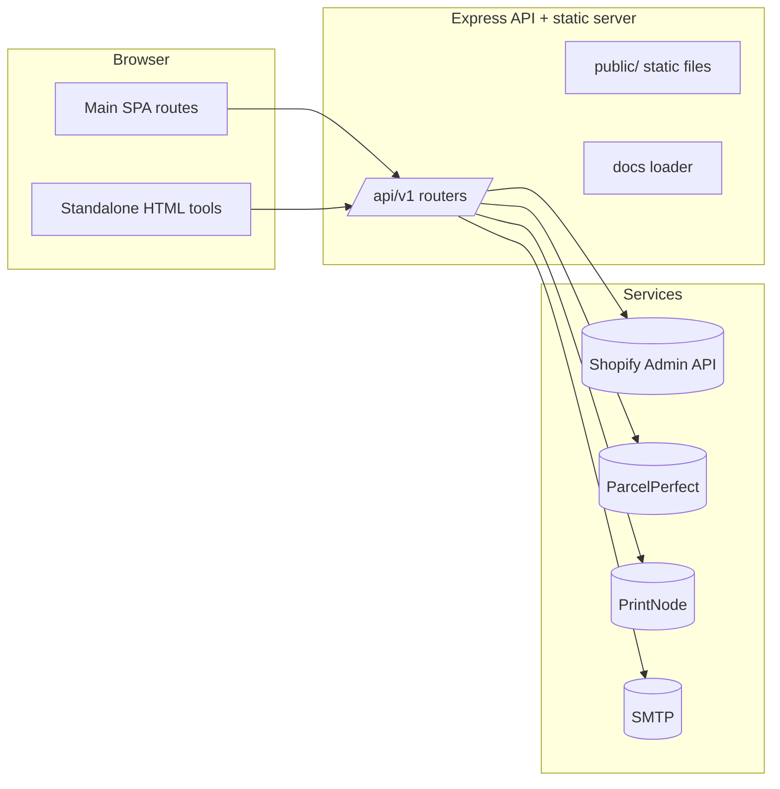

# Flippen Lekka Scan Station (FLSS)

FLSS is a Node + Express operations platform for order capture, dispatch workflows, shipping bookings, label printing, inventory actions, pricing tiers, template management, and batch traceability.

- **Backend API base:** `/api/v1`
- **Primary SPA shell:** `http://localhost:3000`
- **Static utility pages:** served from `public/*.html`

## What is in the app today

### Internal SPA routes (single shell)

- `/` — **Orders / Scan Station**
- `/ops` — **Dispatch Board**
- `/docs` — **Docs browser** (renders `README.md` + `docs/*.md`)
- `/flowcharts` — **Dispatch and packing flow guidance**
- `/flocs` — **Order Capture (FLOCS)**
- `/stock` — **Stock tools**
- `/price-manager` — **Price Manager**
- `/dispatch-settings` — **Dispatch settings panel** (admin-unlocked)
- `/logs` — **Ops logs panel** (admin-unlocked)
- `/admin` and `/changelog` — internal utility views

### Static pages and tools

- `/shipping-matrix.html` — ParcelPerfect quote matrix simulator
- `/order-capture-custom.html` — password-gated custom order capture page
- `/customer-accounts.html` — customer self-service demo flows
- `/purchase-orders.html` — create tagged purchase-order draft orders
- `/liquid-templates.html` — template CRUD + preview
- `/notification-templates.html` — notification template CRUD + preview
- `/traceability.html` — batch traceability report generator

---

## Architecture


```mermaid
flowchart LR
  subgraph Browser
    SPA[Main SPA routes]
    Static[Standalone HTML tools]
  end

  subgraph Server[Express API + static server]
    API[/api/v1 routers/]
    Public[public/ static files]
    Docs[docs loader]
  end

  subgraph Services
    Shopify[(Shopify Admin API)]
    ParcelPerfect[(ParcelPerfect)]
    PrintNode[(PrintNode)]
    SMTP[(SMTP)]
  end

  SPA --> API
  Static --> API
  Server --> Public
  Server --> Docs
  API --> Shopify
  API --> ParcelPerfect
  API --> PrintNode
  API --> SMTP
```

---

## API modules

All routes below are mounted at `/api/v1`.

### Core

- `GET /healthz` — liveness
- `GET /statusz` — integration health/status summary
- `GET /config` — UI/runtime config projection

### Documentation

- `GET /docs` — docs topic index
- `GET /docs/:slug` — markdown by slug

### ParcelPerfect

- `POST /pp` — booking/quote proxy
- `GET /pp/place?q=...` — place lookup
- `POST /pp/matrix` — shipping matrix simulation

### PrintNode

- `POST /printnode/print`
- `POST /printnode/print-delivery-note`
- `POST /printnode/print-url`

### Alerts

- `POST /alerts/book-truck` — truck booking email

### Customer accounts

- `POST /customer-accounts/register`
- `POST /customer-accounts/login`
- `POST /customer-accounts/logout`
- `GET /customer-accounts/me`
- `PUT /customer-accounts/me`
- `GET /customer-accounts/catalog`
- `GET /customer-accounts/orders`
- `POST /customer-accounts/orders`

### Template management

- Liquid templates:
  - `GET /liquid-templates`
  - `POST /liquid-templates`
  - `DELETE /liquid-templates/:id`
- Notification templates:
  - `GET /notification-templates`
  - `POST /notification-templates`
  - `DELETE /notification-templates/:id`

### Traceability

- `GET /traceability/template.xlsx` — sample workbook template
- `POST /traceability/report` — batch traceability report generation

### Shopify proxy groups (high-level)

- Customers, products, collections, payment term options
- Tiered pricing + price tier metafield fetch/upsert
- Draft order creation/completion + purchase-order helpers
- Orders (create/list/open/by-name/cash/tag updates)
- Fulfillment + recent shipments + fulfill-from-code collection flow
- Inventory levels/locations/set/transfer
- Pricing resolve and draft reconciliation endpoints
- Customer notification endpoint for collection readiness

---

## Environment configuration

Create `.env` in project root.

```bash
PORT=3000
HOST=0.0.0.0
NODE_ENV=development
FRONTEND_ORIGIN=http://localhost:3000

# ParcelPerfect
PP_BASE_URL=
PP_TOKEN=
PP_REQUIRE_TOKEN=true
PP_ACCNUM=
PP_PLACE_ID=
PP_TIMEOUT_MS=10000

# Shopify
SHOPIFY_STORE=
SHOPIFY_CLIENT_ID=
SHOPIFY_CLIENT_SECRET=
SHOPIFY_API_VERSION=2025-10
SHOPIFY_FLOW_TAG=dispatch_flow
SHOPIFY_TIMEOUT_MS=10000
SHOPIFY_THROTTLE_MAX_CONCURRENCY=4
SHOPIFY_THROTTLE_BASE_DELAY_MS=250
SHOPIFY_THROTTLE_MAX_DELAY_MS=5000
SHOPIFY_THROTTLE_CALL_LIMIT_RATIO=0.85

# PrintNode
PRINTNODE_API_KEY=
PRINTNODE_PRINTER_ID=
PRINTNODE_DELIVERY_NOTE_PRINTER_ID=
PRINTNODE_DELIVERY_NOTE_PRINTER_IDS=
PRINTNODE_TIMEOUT_MS=10000

# SMTP
SMTP_HOST=
SMTP_PORT=587
SMTP_USER=
SMTP_PASS=
SMTP_SECURE=false
SMTP_FROM=
TRUCK_EMAIL_TO=

# UI tuning
UI_BOOKING_IDLE_MS=6000
UI_COST_ALERT_THRESHOLD=250
UI_TRUCK_ALERT_THRESHOLD=25
UI_BOX_DIM_1=40x30x20
UI_BOX_DIM_2=45x35x25
UI_BOX_DIM_3=50x40x30
UI_BOX_MASS_KG=1
UI_ORIGIN_PERSON=
UI_ORIGIN_ADDR1=
UI_ORIGIN_ADDR2=
UI_ORIGIN_ADDR3=
UI_ORIGIN_ADDR4=
UI_ORIGIN_POSTCODE=
UI_ORIGIN_TOWN=
UI_ORIGIN_PLACE_ID=
UI_ORIGIN_CONTACT=
UI_ORIGIN_PHONE=
UI_ORIGIN_CELL=
UI_ORIGIN_NOTIFY=
UI_ORIGIN_EMAIL=
UI_ORIGIN_NOTES=
UI_FEATURE_MULTI_SHIP=true
```

---

## Local development

```bash
npm install
npm run dev
```

Open `http://localhost:3000`.

### Test suite

```bash
npm test
```

### Utility scripts

```bash
npm run po:catalog:generate
npm run traceability:template:generate
```

---

## Admin unlock shortcut (SPA)

Some nav entries are hidden by default and can be toggled in-browser:

- **Shortcut:** `Shift + Alt + A`
- Toggles visibility for docs/flowcharts/price-manager/dispatch-settings/logs menus.
- Uses `localStorage` key `fl_admin_unlocked`.

---

## Documentation map

- Build/run and deployment: `docs/build-guide.md`
- Endpoints and payload guide: `docs/api-reference.md`
- Feature + data model: `docs/data-model.md`
- Traceability workflow details: `docs/traceability-workflow.md`
- Cloudflare tunnel publishing: `docs/cloudflare-tunnel.md`
- Shopify theme tier rendering approach: `docs/price-tiers-theme.md`
- Raspberry Pi station controller concept: `docs/raspberry-pi-station-controller-schematic.md`
