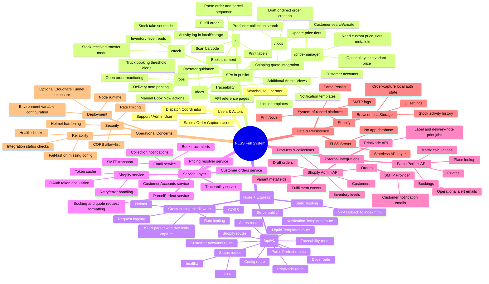
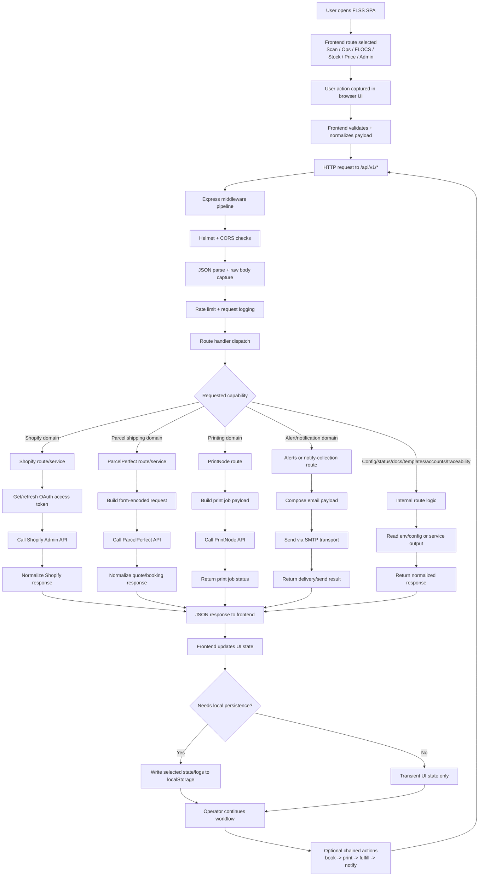

# FLSS Full System Mind Map and Process Flow

This document provides two architecture views for the full Flippen Lekka Scan Station (FLSS) system:

1. A **mind map** for static structure (capabilities, modules, integrations, and data boundaries).
2. A **process flow chart** for runtime behavior (from operator action to external side effects).

---

## 1) Full System Mind Map

---

## 2) Full System Process Flow Chart

---

## Notes for use

- These diagrams are designed for onboarding, operations handover, and architecture reviews.
- The mind map is ideal for discussing ownership and boundaries.
- The process flow chart is ideal for debugging cross-system workflows and identifying where errors are introduced.
